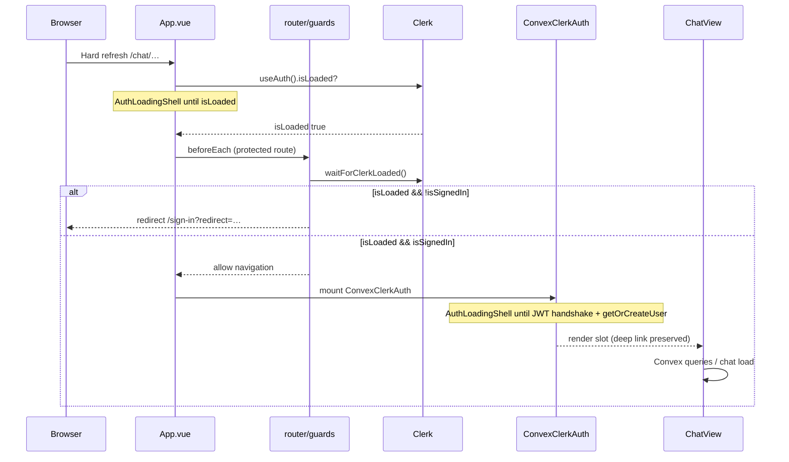

# Auth flow on refresh

Protected routes (e.g. `/chat/:conversationId`) must not flash sign-in or empty unauthenticated UI while Clerk and Convex initialize.

## Boot sequence

## Layers

| Layer | File | Role |
|-------|------|------|
| Clerk session | `App.vue` | `AuthLoadingShell` while `!useAuth().isLoaded` |
| Router | `router/guards.ts` | Wait for `isLoaded`; redirect only when `isLoaded && isSignedIn === false`; preserve `?redirect=` |
| Handshake bypass | `lib/clerkConfig.ts` | `__clerk_handshake*` query params skip redirects |
| Convex bridge | `ConvexClerkAuth.vue` | `setAuth` + loading shell until handshake and user provisioning |
| Data readiness | `useConvexAuthReady.ts` | `useConvexAuthPending()` — missing inject = pending, not signed-out |
| Chat data | `useGroqChat.ts` | Skips conversation fetch while Convex auth is pending |

## Guard rules

1. **Never** redirect to `/sign-in` before Clerk `isLoaded` is true.
2. On timeout waiting for Clerk, allow navigation — `App.vue` still blocks UI until loaded.
3. Sign-in / sign-up routes: if already signed in, honor `?redirect=` or fallback URL.
4. Admin routes: after auth, query Convex role before allowing access.

## Guard installation

Guards register in `main.ts` via `app.runWithContext(() => installAuthGuards(router))` after `clerkPlugin`, so the first navigation always runs guarded code.

## Expected refresh behavior (signed-in user)

1. Full-page **Loading session…** spinner (no nav, no sign-in flash).
2. **Connecting…** while Convex JWT handshake runs (still on `/chat/…`).
3. Chat renders with sidebar and conversation loaded — URL unchanged.

## Expected refresh behavior (signed-out user)

1. **Loading session…** briefly.
2. Redirect to `/sign-in?redirect=/chat/…` once Clerk confirms signed-out state.
3. After sign-in, return to the original chat URL via `redirect` query.
