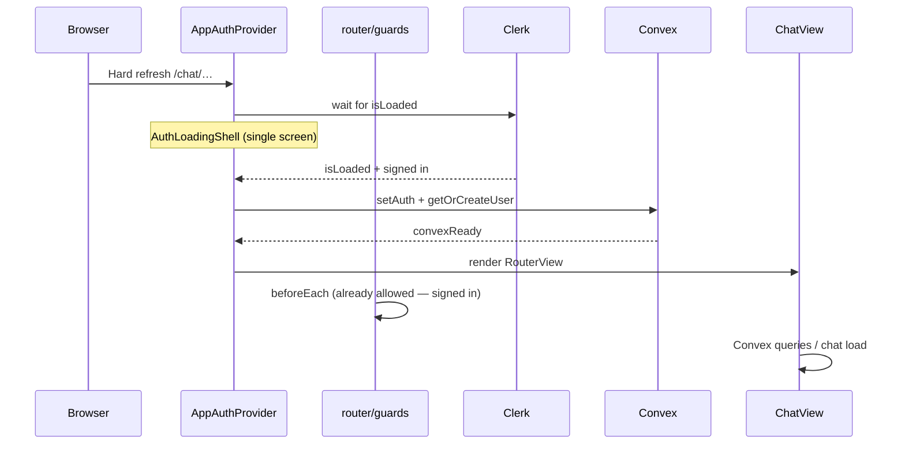

# Auth flow on refresh

One provider (`AppAuthProvider.vue`) owns Clerk session load, Convex JWT wiring, and user provisioning. Router guards only check Clerk session (plus admin role after Convex is ready).

## Boot sequence

## Layers

| Layer | File | Role |
|-------|------|------|
| Auth orchestrator | `providers/AppAuthProvider.vue` | Clerk load → Convex `setAuth` → `getOrCreateUser` → show routes |
| Shared state | `lib/authSession.ts` | `clerkLoaded`, `clerkSignedIn`, `convexReady`, `userRole` for guards/composables |
| Router | `router/guards.ts` | Wait for Clerk; redirect signed-out users; admin uses cached `userRole` |
| Handshake bypass | `lib/clerkConfig.ts` | `__clerk_handshake*` query params skip redirects |
| Data readiness | `useConvexAuthReady.ts` | `convexReady` for query skip / chat fetch gating |

## Guard rules

1. **Never** redirect to `/sign-in` before Clerk `isLoaded` is true.
2. Sign-in / sign-up: if already signed in, honor `?redirect=` or fallback URL.
3. Protected routes: redirect when `isLoaded && isSignedIn === false`.
4. Admin routes: wait for `convexReady`, then check `userRole === 'admin'`.

## Guard installation

Guards register in `main.ts` via `app.runWithContext(() => installAuthGuards(router))` after `clerkPlugin`.

## Expected refresh behavior (signed-in user)

1. Single **Loading session…** / **Connecting…** spinner (no sign-in flash, URL preserved).
2. Chat renders with sidebar and conversation loaded.

## Expected refresh behavior (signed-out user)

1. **Loading session…** briefly.
2. Redirect to `/sign-in?redirect=/chat/…` once Clerk confirms signed-out state.
